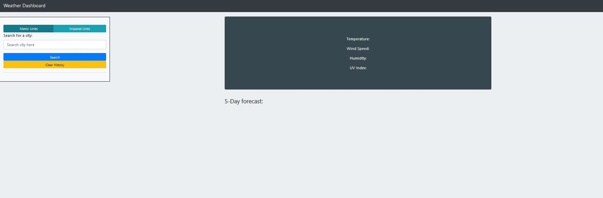
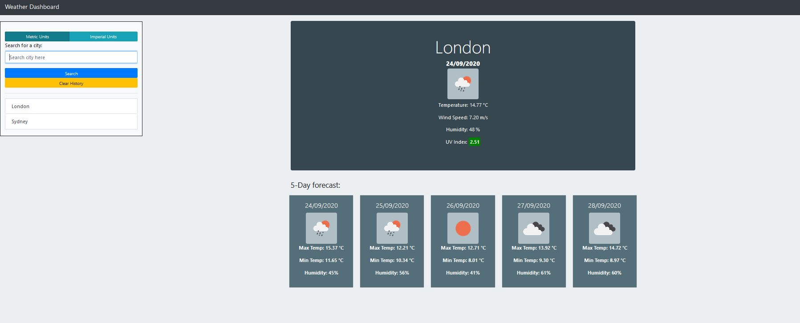
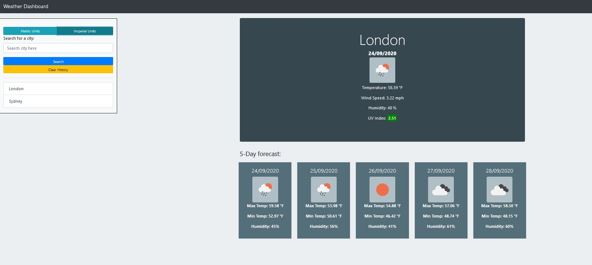
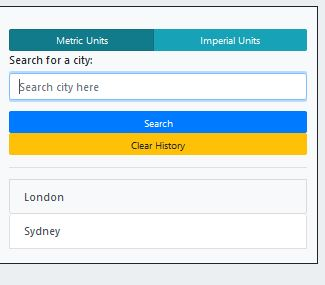
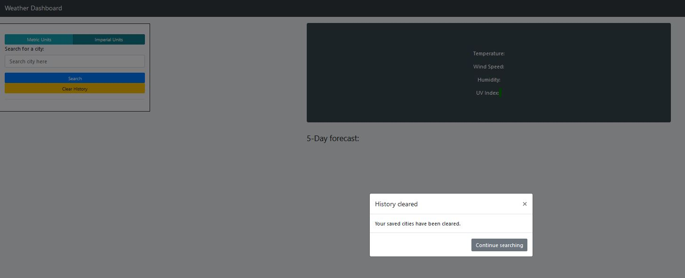

# 06 Server-Side APIs: Weather Dashboard

Developers are often tasked with retrieving data from another application's API and using it in the context of their own. Third-party APIs allow developers to access their data and functionality by making requests with specific parameters to a URL. My given challenge is to build a weather dashboard that will run in the browser and feature dynamically updated HTML and CSS displaying forecasts for the searched city, and saving those searches. 

## User Story

```
AS A traveler
I WANT to see the weather outlook for multiple cities
SO THAT I can plan a trip accordingly
```

## Acceptance Criteria

```
GIVEN a weather dashboard with form inputs
WHEN I search for a city
THEN I am presented with current and future conditions for that city and that city is added to the search history
WHEN I view current weather conditions for that city
THEN I am presented with the city name, the date, an icon representation of weather conditions, the temperature, the humidity, the wind speed, and the UV index
WHEN I view the UV index
THEN I am presented with a color that indicates whether the conditions are favorable, moderate, or severe
WHEN I view future weather conditions for that city
THEN I am presented with a 5-day forecast that displays the date, an icon representation of weather conditions, the temperature, and the humidity
WHEN I click on a city in the search history
THEN I am again presented with current and future conditions for that city
WHEN I open the weather dashboard
THEN I am presented with the last searched city forecast
```

## Code

- Uses the [OpenWeather API](https://openweathermap.org/api) to retrieve weather data for cities.
- Working towards following SOLID principles.
- Allows for metric units to change based on user choice.
- Primary functions handled by script.js. Some internal HTML targeting using bootstraps modal framework.
- Mixed custom CSS and bootstrap framework

## Demonstation

Deployable link - hosted on github pages\_
Link: https://agr2020xman.github.io/Weather-Dashboard/

_Front page_


_Forecast active_


_Changing forecast units on active loaded forecast_


_Searches saving (Top = most recent) + will presist on refresh_



_Clear history removes all locally stored data & clears searchs_


### Author

- Code from scratch by Andr&eacute; Grech - 24/09/2020

#### Tools 

- [OpenWeatherAPI](https://openweathermap.org/api)
- [VScode](https://code.visualstudio.com/) - The editor of choice.
- [jQuery](https://api.jquery.com/)
- [Bootstrap](https://getbootstrap.com/)

#### License

- [MIT License](https://opensource.org/licenses/MIT)

#### Acknowledgments

- © 2019 Trilogy Education Services, a 2U, Inc. brand. All Rights Reserved.
